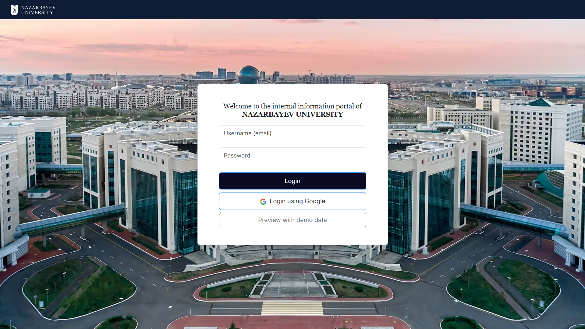
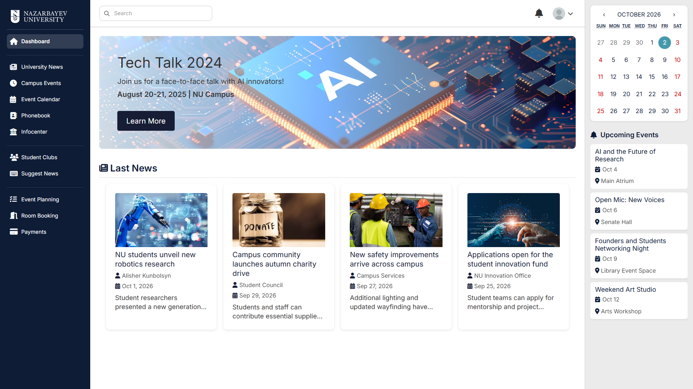
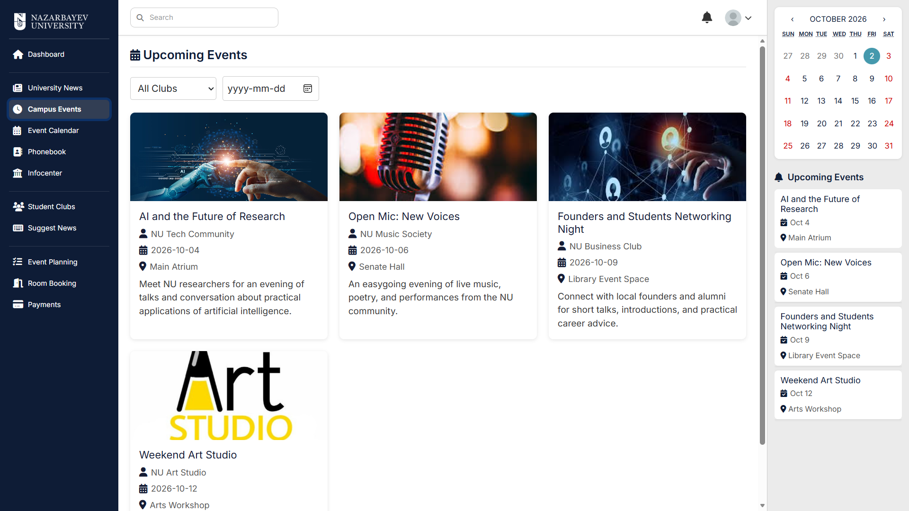
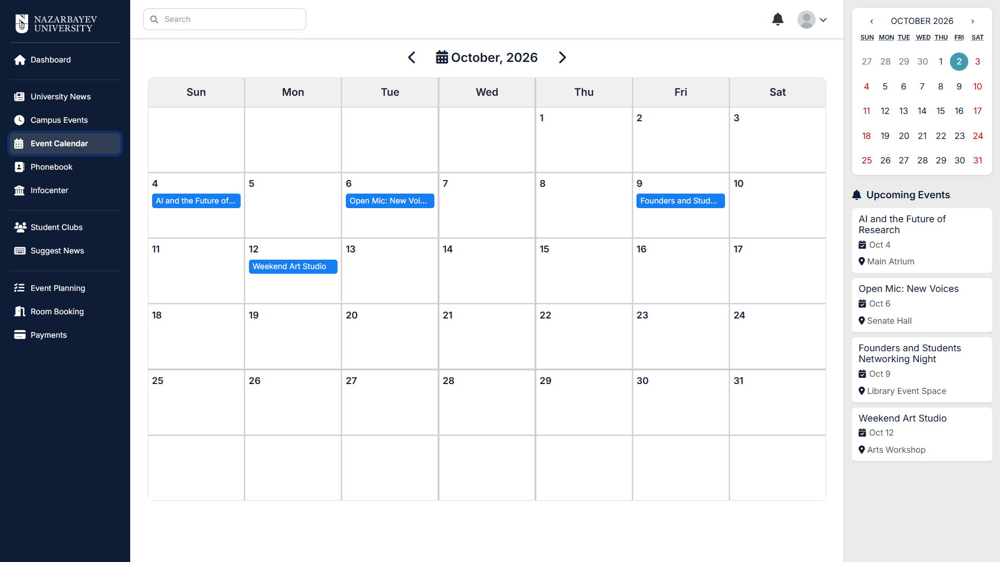
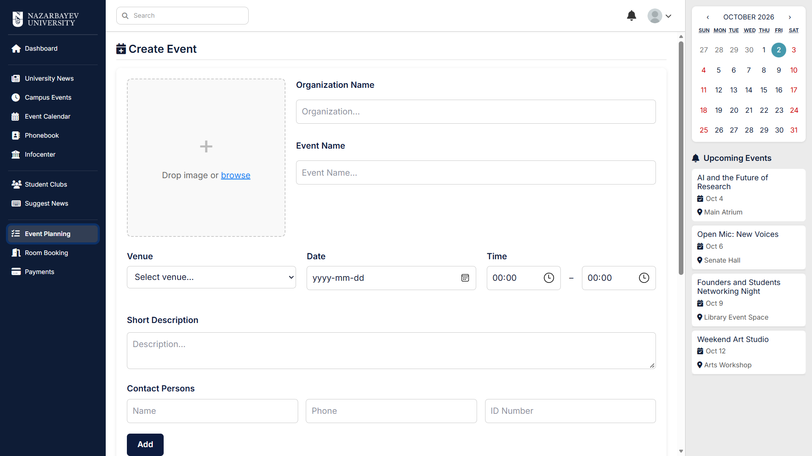
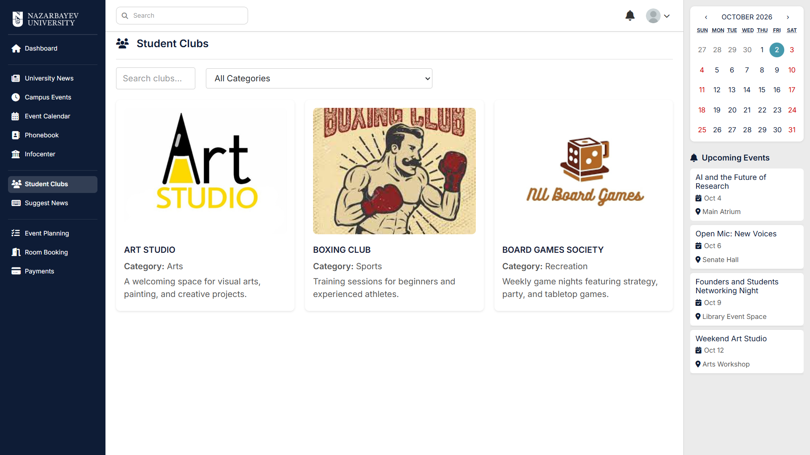
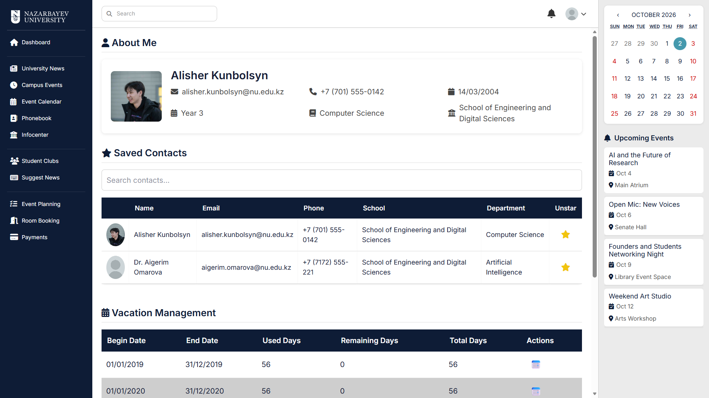

# NU Corporate Web Portal

The NU Corporate Web Portal brings campus news, events, venue requests, and university resources into one place. It is designed for the Nazarbayev University community, with pages and actions organized around the needs of students, teaching staff, DSS, and other university staff.

This repository contains the React frontend. It connects to a Spring Boot REST API for live, account-based features, and also includes sample data so visitors can preview the interface without signing in.

## Screenshots

### Sign in and preview

Choose **Preview with demo data** to open the portal as a sample student. No account is needed to browse the demo.



### Student dashboard

The dashboard brings campus announcements and upcoming events together.



### Campus events

Browse events and filter the listings by club or date.



### Event calendar

See scheduled events in a monthly calendar view.



### Event planning

Submit an event with its venue, date, time, description, and contact details.



### Student clubs

Explore student organizations by name or category.



### My Page

View a student profile and saved contacts.



## What the portal includes

- Campus news, student news submissions, and news moderation
- Event listings, a calendar, event submissions, and staff event management
- Venue booking with availability and scheduling workflows
- Student clubs, a university phonebook, and saved contacts
- A personal account page, payments page, and Infocenter resources
- Navigation and access tailored to the user's role

The demo uses local sample content for browsing. Actions that need account authentication or a live backend, such as submitting or managing records, may not be available in preview mode.

## Run locally

### Prerequisites

- Node.js and npm
- Git, if you are cloning the repository

### Start the frontend

```bash
git clone https://github.com/kunbolsyn/nu-portal.git
cd nu-portal
npm install
npm start
```

The development server opens at [http://localhost:3000](http://localhost:3000). Open the login page and choose **Preview with demo data** to explore the sample student experience.

The frontend is configured to use the project's hosted backend for live requests. The backend is not part of this repository; live sign-in and backend-dependent actions require that API to be available and a valid account. Demo preview is the simplest way to run the interface locally.

### Other commands

```bash
npm test                 # Run the test suite
npm run build             # Create a production build in build/
```

## Implementation and deployment

The frontend is built with React, React Router, and React Bootstrap. The wider system uses a Spring Boot REST API, PostgreSQL, Spring Security with JWT authentication, and Azure Blob Storage for uploaded files. Docker is used for backend deployment.

The frontend is published through GitHub Pages, and the backend is hosted on Render. Backend source code is in the [senior-project-java-backend repository](https://github.com/Merkel00/senior-project-java-backend).

## Project evaluation

Five volunteers tried representative tasks as students, DSS staff, and faculty. Four of the five rated event planning and submission as easy to use. All testers successfully scanned a QR code, and the system prevented duplicate scans. Testers also found venue availability useful for avoiding double bookings; a more interactive calendar was suggested as a future improvement.

## Team

- **Assylzhan Omarov** — Project manager and backend developer
- **Marlen Nuraly** — Backend developer
- **Alisher Kunbolsyn** — Frontend developer
- **Dinmukhamet Batmanov** — Frontend developer
- **Nazira Ibrasheva** — UI/UX designer and frontend developer

**Advisers:** Askar Boranbayev and Almas Amirbekov

## References

- [Spring Boot](https://spring.io/projects/spring-boot)
- [PostgreSQL documentation](https://www.postgresql.org/docs/)
- [Render documentation](https://render.com/docs)
- [Docker documentation](https://docs.docker.com/)
- [goQR API](https://goqr.me/api/)
